# 🍺 Пивница — Веб-сайт бар-ресторана

[](https://www.djangoproject.com/)
[](https://www.python.org/)
[](LICENSE)
[](https://www.sqlite.org/)
[](https://scikit-learn.org/)

> Веб-сайт для бар-ресторана «Пивница» с функционалом онлайн-бронирования, меню, афиши мероприятий и ML-рекомендациями.

---

## 📸 Скриншоты

### Десктопная версия

| Главная страница | Страница меню |
|------------------|---------------|
|  | 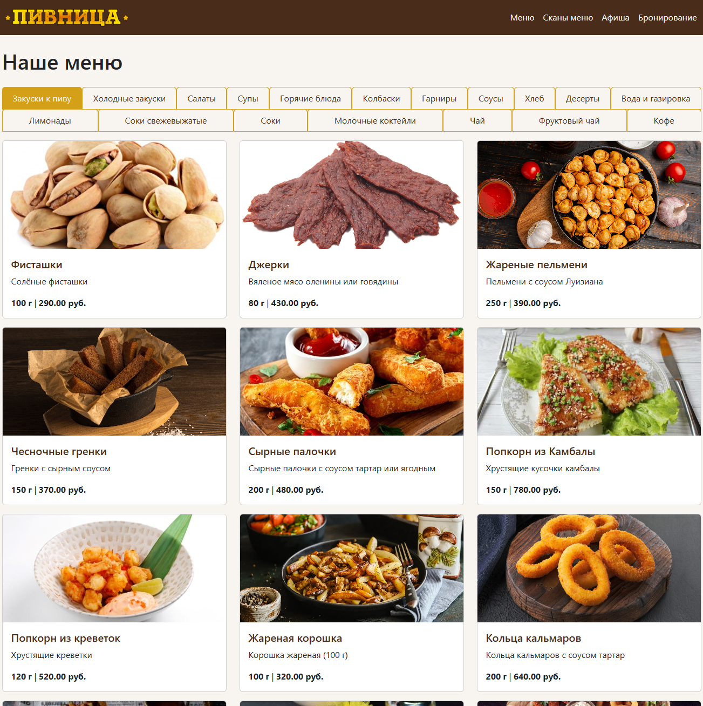 |

| Фильтрация меню | Афиша мероприятий |
|-----------------|-------------------|
| 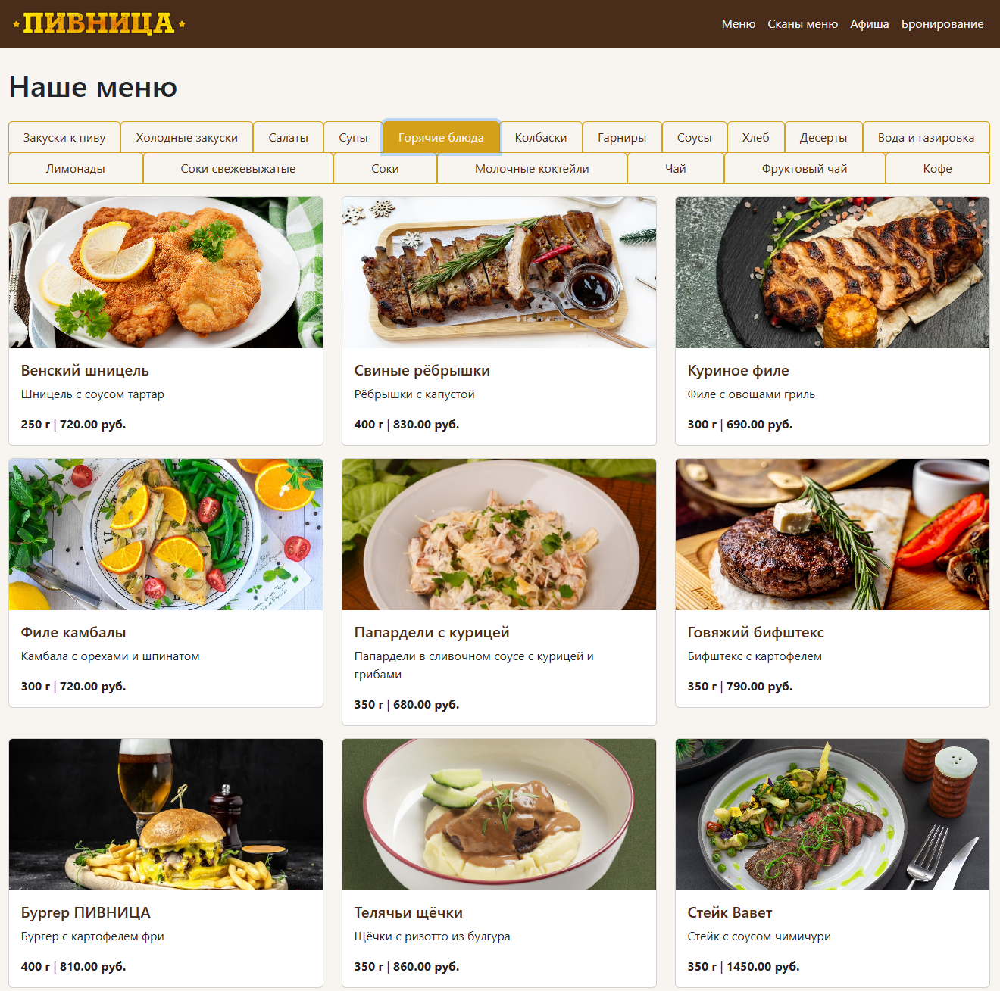 | 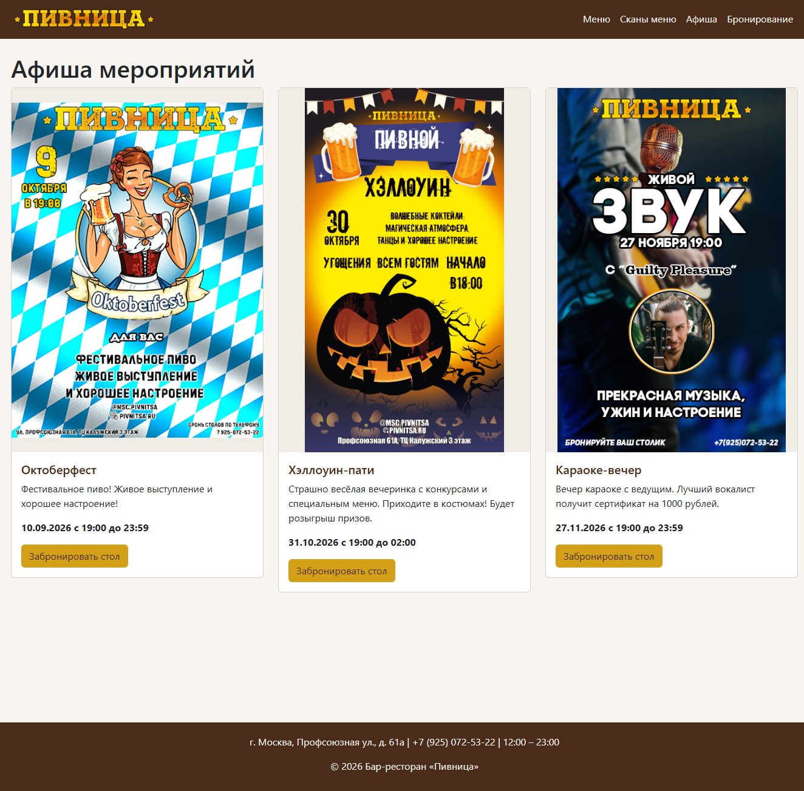 |

| Детали мероприятия | Форма бронирования |
|--------------------|-------------------|
| 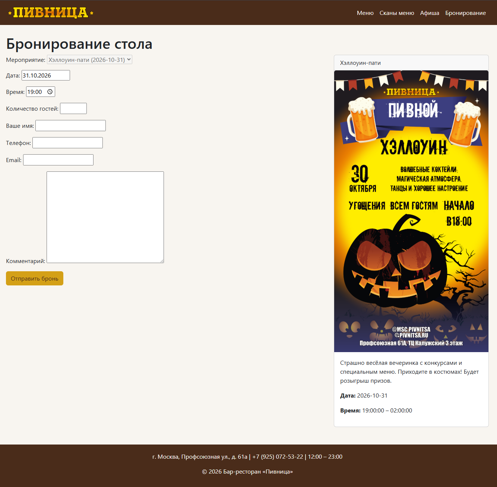 | 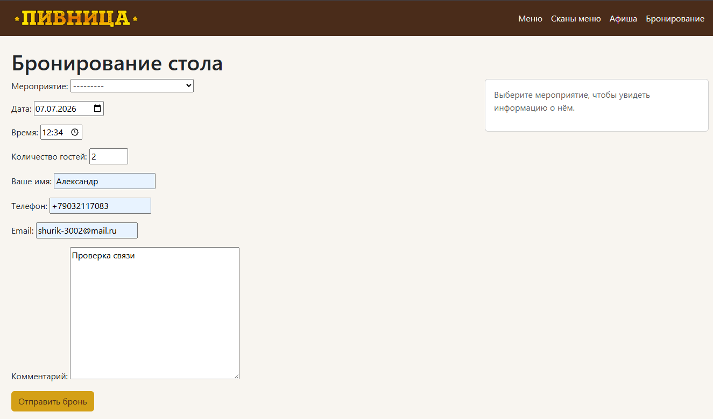 |

| Успешное бронирование | Бумажное меню |
|----------------------|---------------|
| 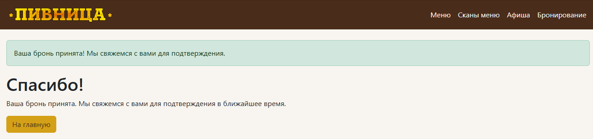 | 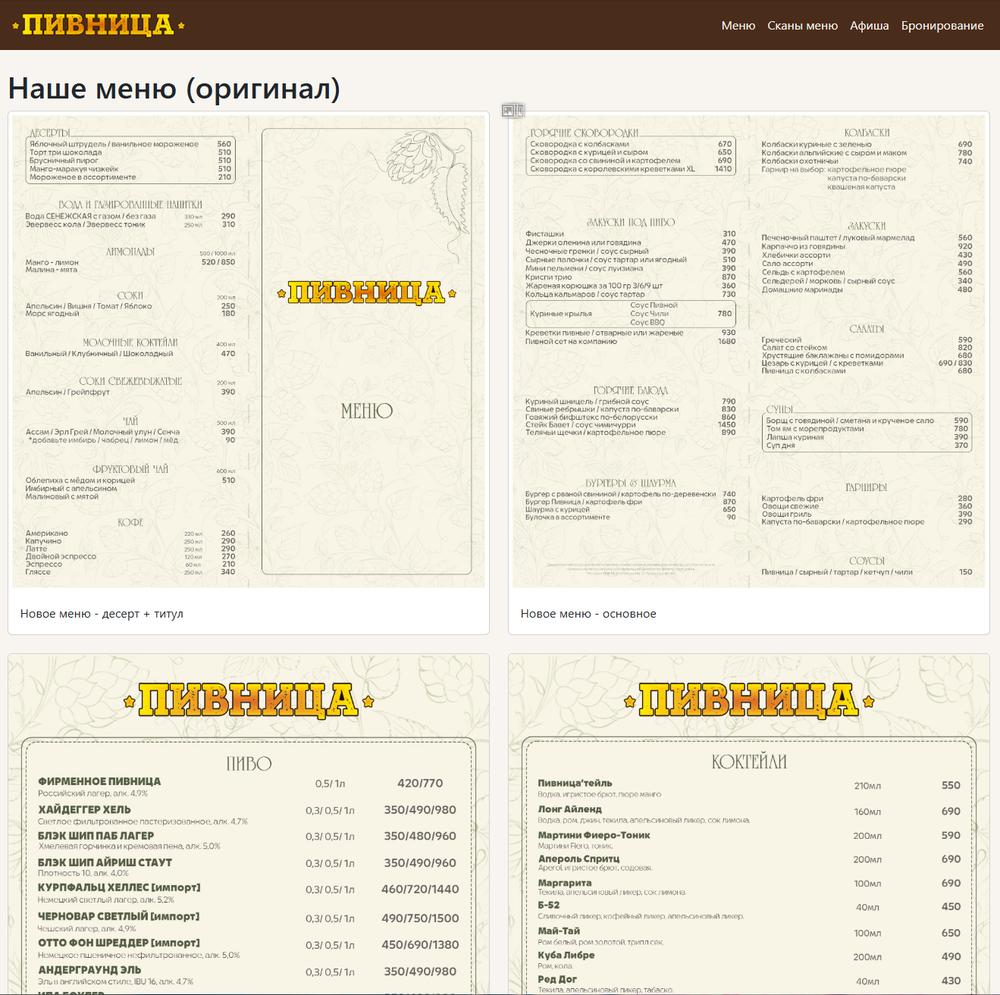 |

| Админ-панель | Редактирование блюда |
|--------------|---------------------|
| 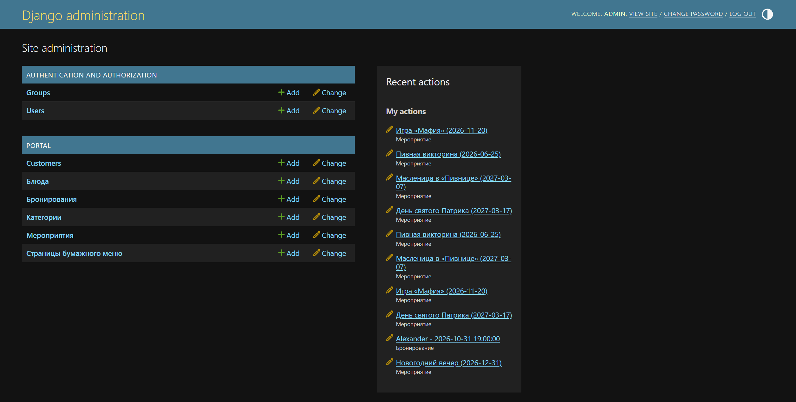 | 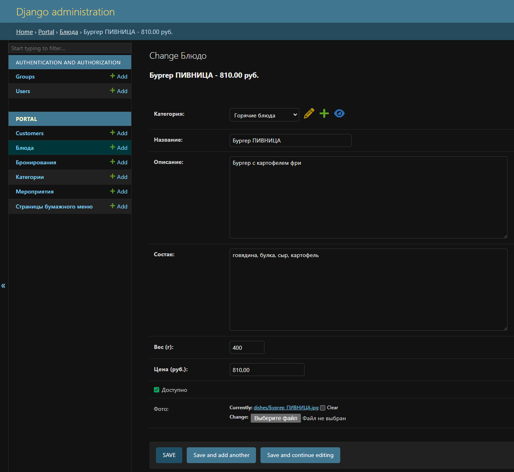 |

### Мобильная версия

| Главная страница | Мобильное меню |
|------------------|----------------|
| 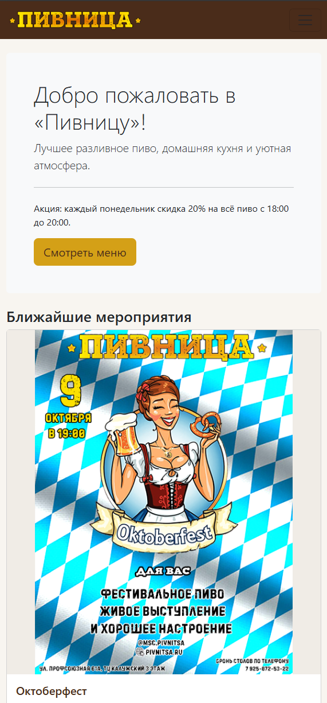 | 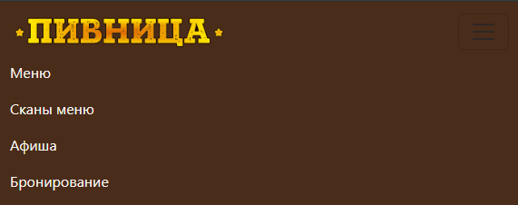 |

> **Все скриншоты** демонстрируют реальную работу сайта с тестовыми данными.

---

## ✨ Функциональность

### 🍽️ Меню
- **Категории блюд** (закуски, супы, горячее, пиво и т.д.)
- **Детальное описание** каждого блюда (состав, вес, цена)
- **Фотографии блюд**
- **Фильтрация** по категориям с помощью вкладок

### 🤖 ML-рекомендации (НОВОЕ!)
- **Система рекомендаций блюд** на основе TF-IDF и косинусного сходства
- **API-эндпоинты** для получения рекомендаций
- **Анализ данных** в Jupyter Notebook
- **Персональные рекомендации** для клиентов (в разработке)

### 📅 Мероприятия (Афиша)
- Список предстоящих мероприятий
- Детальная информация о каждом событии
- Быстрое бронирование стола прямо с карточки мероприятия
- Автоматическая подстановка даты и времени при бронировании

### 📋 Бумажное меню
- Сканы оригинального меню для просмотра в высоком качестве
- Постраничная навигация
- Удобный просмотр на мобильных устройствах

### 🪑 Бронирование
- **Онлайн-форма** для бронирования стола
- **Интеграция с мероприятиями** — автоматическая подстановка даты и времени
- **Автоматическое создание клиента** при бронировании
- **Статусы бронирования**: ожидает, подтверждено, отменено, выполнено
- **Бонусная система** для клиентов
- **API-эндпоинты** для динамической подгрузки информации о мероприятиях
- **Валидация** времени бронирования (не ранее начала и не позже окончания мероприятия)

### 👥 Админ-панель
- Управление категориями и блюдами
- Управление мероприятиями
- Управление клиентами и бронированиями
- Загрузка изображений для бумажного меню
- Полный CRUD для всех моделей

### 📱 Адаптивный дизайн
- Полностью адаптивная вёрстка на Bootstrap 5
- Оптимизированные изображения для мобильных устройств
- Удобная навигация через бургер-меню на телефонах

---

## 🛠 Технологии

- **Backend**: Django 4.2
- **Database**: SQLite (разработка), PostgreSQL (продакшн)
- **Frontend**: Bootstrap 5, HTML5, CSS3
- **JavaScript**: Vanilla JS (AJAX для динамической подгрузки)
- **ORM**: Django ORM
- **Шаблоны**: Django Template Language
- **Machine Learning**: Scikit-learn, Pandas, Jupyter Notebook

---

## 🤖 ML-рекомендательная система

### Как работает
1. **Данные** — загружаются из Django-моделей (блюда, категории)
2. **Векторизация** — TF-IDF преобразует текстовые описания в числовые векторы
3. **Сходство** — косинусное сходство между векторами блюд
4. **Рекомендации** — топ-5 похожих блюд для выбранного блюда

### API-эндпоинты

| Эндпоинт | Метод | Описание |
|----------|-------|----------|
| `/api/recommend/` | GET | Получить рекомендации (на основе случайного блюда) |
| `/api/recommend/<customer_id>/` | GET | Рекомендации для конкретного клиента |
| `/api/popular/` | GET | Получить популярные блюда |

### Пример ответа API

```json
{
  "success": true,
  "based_on": "Попкорн из креветок",
  "recommendations": [
    {
      "id": 6,
      "name": "Попкорн из Камбалы",
      "price": 780,
      "similarity": 0.593
    },
    {
      "id": 11,
      "name": "Креветки пивные",
      "price": 890,
      "similarity": 0.522
    }
  ]
}
```

### Структура ML-модуля

```
ml/
├── data/               # CSV-файлы с данными
├── notebooks/          # Jupyter Notebooks для анализа
│   └── 01_data_exploration.ipynb
├── models/             # Сохранённые модели
│   └── recommender.pkl
├── data_loader.py      # Загрузка данных из Django
├── recommender.py      # Класс рекомендательной системы
└── train_model.py      # Скрипт обучения модели
```

### Обучение модели

```bash
python -m ml.train_model
```

---

## 🗂 Структура проекта

```
pivnica_portal/
├── manage.py                 # Точка входа в проект
├── requirements.txt          # Зависимости
├── pivnica/                  # Основная конфигурация проекта
│   ├── settings.py          # Настройки Django
│   ├── urls.py              # Главные URL-адреса
│   └── wsgi.py              # WSGI-конфигурация
├── portal/                  # Основное приложение
│   ├── models.py            # Модели данных
│   ├── views.py             # Контроллеры
│   ├── forms.py             # Формы
│   ├── urls.py              # URL-адреса приложения
│   ├── admin.py             # Админ-панель
│   ├── templates/           # HTML-шаблоны
│   └── migrations/          # Миграции базы данных
└── ml/                      # ML-модуль (НОВОЕ!)
    ├── data/                # Данные для ML
    ├── notebooks/           # Jupyter Notebooks
    ├── models/              # Сохранённые модели
    ├── data_loader.py       # Загрузка данных
    ├── recommender.py       # Рекомендательная система
    └── train_model.py       # Обучение модели
```

---

## 📦 Модели данных

### Category (Категория)
- Название, описание, порядок сортировки

### Dish (Блюдо)
- Название, описание, состав, вес, цена
- Категория (FK), фото, доступность

### Event (Мероприятие)
- Название, описание, дата, время начала/окончания
- Специальное меню, активность, фото

### Customer (Клиент)
- Имя, телефон (уникальный), email
- Бонусы, дата регистрации

### Reservation (Бронирование)
- Клиент (FK), мероприятие (FK)
- Дата, время, количество гостей
- Статус, комментарий

### PaperMenu (Бумажное меню)
- Заголовок, изображение страницы
- Порядок отображения

---

## 🚀 Установка и запуск

### Локальный запуск

1. **Клонируйте репозиторий**
   ```bash
   git clone https://github.com/ShurikPozd/pivnica_portal.git
   cd pivnica_portal
   ```

2. **Создайте виртуальное окружение**
   ```bash
   python -m venv venv
   source venv/bin/activate  # Linux/macOS
   venv\Scripts\activate     # Windows
   ```

3. **Установите зависимости**
   ```bash
   pip install -r requirements.txt
   ```

4. **Примените миграции**
   ```bash
   python manage.py migrate
   ```

5. **Создайте суперпользователя**
   ```bash
   python manage.py createsuperuser
   ```

6. **Обучите ML-модель**
   ```bash
   python -m ml.train_model
   ```

7. **Запустите сервер разработки**
   ```bash
   python manage.py runserver
   ```

8. **Откройте в браузере**
   ```
   http://127.0.0.1:8000
   ```

### Настройка медиа-файлов

Для работы с изображениями создайте папку `media/`:

```bash
mkdir -p media/dishes
mkdir -p media/events
mkdir -p media/paper_menu
```

### Админ-панель

```
http://127.0.0.1:8000/admin
```

---

## 🔧 API-эндпоинты

| Эндпоинт | Метод | Описание |
|----------|-------|----------|
| `/api/event-date/<int:event_id>/` | GET | Получить дату мероприятия |
| `/api/event-times/<int:event_id>/` | GET | Получить время начала и окончания |
| `/api/event-detail/<int:event_id>/` | GET | Получить полную информацию о мероприятии |
| `/api/recommend/` | GET | Получить рекомендации блюд |
| `/api/recommend/<customer_id>/` | GET | Рекомендации для конкретного клиента |
| `/api/popular/` | GET | Получить популярные блюда |

---

## 📱 Страницы

| URL | Название | Описание |
|-----|----------|----------|
| `/` | Главная | Приветствие и ближайшие мероприятия |
| `/menu/` | Меню | Категории и список блюд |
| `/events/` | Афиша | Список мероприятий |
| `/reservation/` | Бронирование | Форма бронирования стола |
| `/paper-menu/` | Бумажное меню | Сканы оригинального меню |

---

## 🎨 Дизайн

- **Цветовая схема**: тёплые пивные тона (#4a2c1a — тёмный, #d4a017 — золотистый)
- **Шрифты**: стандартные системные
- **Адаптивность**: Bootstrap 5

---

## 🛡 Безопасность

- CSRF-защита включена
- SQL-инъекции защищены через Django ORM
- Валидация форм на серверной стороне
- Минимальные валидаторы (MinValueValidator)

---

## 📊 Статистика

Проект включает:
- Систему бонусов для клиентов
- Отслеживание истории бронирований
- Учёт количества гостей

---

## 🔄 TODO

- [ ] Добавить систему авторизации для клиентов
- [ ] Реализовать личный кабинет с историей бронирований
- [ ] Добавить онлайн-оплату бронирования
- [ ] Систему уведомлений (Telegram/Email)
- [ ] Админ-панель с расширенной статистикой
- [ ] Импорт/экспорт данных
- [x] ML-рекомендательная система
- [ ] Фронтенд-виджет с рекомендациями

---

## 🤝 Вклад в проект

1. Форкните репозиторий
2. Создайте ветку (`git checkout -b feature/AmazingFeature`)
3. Зафиксируйте изменения (`git commit -m 'Add some AmazingFeature'`)
4. Запушьте ветку (`git push origin feature/AmazingFeature`)
5. Откройте Pull Request

---

## 📄 Лицензия

Распространяется под лицензией **MIT**. Подробности в файле [LICENSE](LICENSE).

---

## 📬 Контакты

- GitHub: [ShurikPozd](https://github.com/ShurikPozd)
- Telegram: [@ShurikPozd](https://t.me/ShurikPozd)

---

## ⭐ Поддержка

Если проект вам понравился, поставьте ⭐ на GitHub!

---

## 🚀 Планы по развитию

- [x] ML-рекомендательная система
- [ ] Фронтенд-виджет с рекомендациями
- [ ] Персональные рекомендации для клиентов
- [ ] Рекомендации на основе сезона
- [ ] Анализ поведения пользователей
- [ ] A/B-тестирование рекомендаций

---

**Сделано с ❤️ для портфолио**
